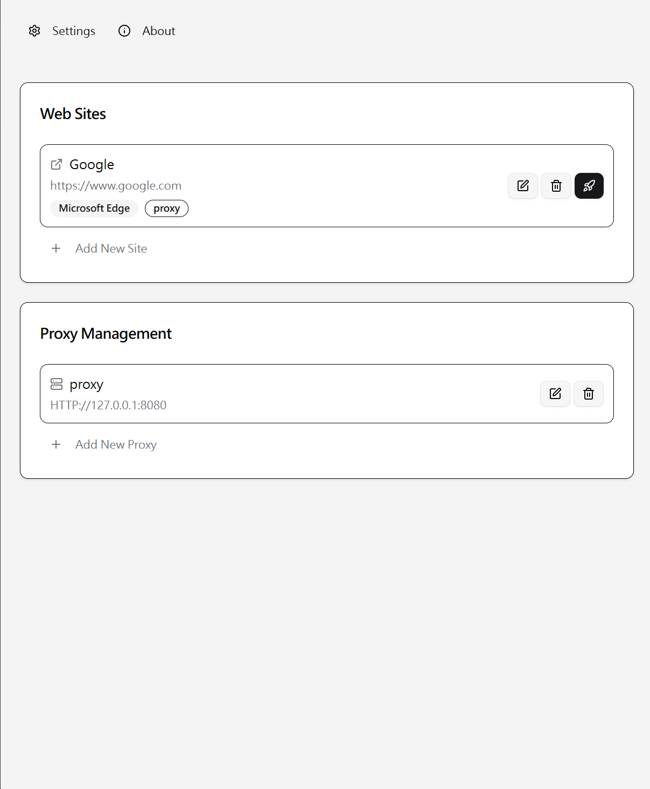

# Browser Proxy Launcher

A desktop application built with Tauri + React + TypeScript that provides an easy-to-use interface for managing browser proxy settings and launching browsers with specific proxy configurations.



## Project Purpose

This application solves the following challenges:

- **Simplified Proxy Management**: Provides an intuitive GUI to manage multiple proxy configurations
- **Multi-Browser Support**: Supports Chrome, Edge, and other browsers with automatic path detection
- **One-Click Launch**: Bind specific websites to proxy settings and launch browsers with a single click
- **Quick Switching**: Switch between different proxy configurations without manual browser settings modification
- **System Integration**: Features system tray, auto-start, and other desktop application capabilities

## Features

- 🔧 **Proxy Management**: Support for HTTP, SOCKS5, PAC proxy types
- 🌐 **Site Management**: Save frequently used websites and bind them to specific proxies
- 🚀 **One-Click Launch**: Launch browsers directly with applied proxy settings
- 🎨 **Modern UI**: Support for dark/light theme switching
- 💾 **Settings Sync**: Import/export configuration files
- 🔄 **Auto Start**: Launch on system startup (minimized to system tray)

## Prerequisites

### Tauri Environment Setup

Please follow the official Tauri installation guide: https://v2.tauri.app/start/prerequisites/

### Node.js Environment

**Install pnpm**

For detailed installation instructions, visit: https://pnpm.io/installation

```bash
npm install -g pnpm
```

**Install Project Dependencies**

```bash
pnpm install
```

## Development

### Start Development Environment

```bash
pnpm tauri dev # Start frontend dev server and Tauri app
```

### Local Proxy Testing

The project includes Docker Compose configuration for quickly setting up test proxy servers:

```bash
# Start test proxy server (using 3proxy)
cd local_proxies
docker-compose up -d

# Default proxies available:
# HTTP Proxy: 127.0.0.1:8080
# SOCKS5 Proxy: 127.0.0.1:1080

# Stop proxy server
docker-compose down
```

**Proxy server configuration file**: `local_proxies/3proxy.cfg`

### Build and Package

```bash
# Build the application
pnpm tauri build

# Output location: src-tauri/target/release/bundle/
```

## Recommended IDE Setup

- [VS Code](https://code.visualstudio.com/) + [Tauri](https://marketplace.visualstudio.com/items?itemName=tauri-apps.tauri-vscode) + [rust-analyzer](https://marketplace.visualstudio.com/items?itemName=rust-lang.rust-analyzer)
